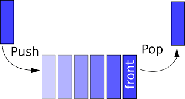

# Intro to STL
Reference: 
- www.cplusplus.com
- https://uhunt.onlinejudge.org

## Containers
Often has following member features:

- `size()`
- `empty()`
- `clear()`
- Iterators
 
### `std::vector`
- Dynamic Array: just use it like a normal array.
- Access elements using `[]`.
- `push_back()`
- `pop_back()`
- ...
***
### `std::stack`

#### Operations
- **FIRST in LAST out** 
- `push()`
- `pop()`
- `top()`
#### Drills
- Parenthesis Matching: UVa 673
- Infix to Postfix Expression: UVa 727
***
### `std::queue`
#### Operations

- **LAST in FIRST out**
- `push()`
- `pop()`
- `front()`
#### Drills
- Breadth First Search 
- UVa 10172
***
### `std::priority_queue`

The underlying data structure of `std::priority_queue` is essentially a min/max binary heap. In STL, the heap is implemented on an array.
#### Operations
- `push()`
- `pop()`
- `top()`
#### Drills
- UVa 10954
- Useful in graph algorithms (more in the future)
### `std::map`, `std::unordered_map`
- The underlying data structure of `map` is a red-black tree (a kind of balanced binary search tree) where the keys are *ordered*.
- The underlying data structure of `unordered_map` is a hash table, where the keys are *unordered*.
```c++
map<char, int>ascii;
ascii['a'] = 61;
```
- `map`: ordered key-value pair
- `unordered_map`: unordered key-value pair
#### Operations
- `count()`
#### Drills
- UVa 10226
### `std::set`, `std::unorderd_set`
Similar to `map`, but the elements are just keys rather than (key, value) pairs.
- `set`: ordered collection of keys
- `unordered_set`: unordered collection of keys
### Operations
- `insert()`
- `count()`
#### Drills 
- UVa 11136
## `<algorithm>`
- `sort()`
```c++
sort(container.begin(), container.end());
```
- `next_permutation()`
```
do {
    ...
} while(next_permutation())
```

